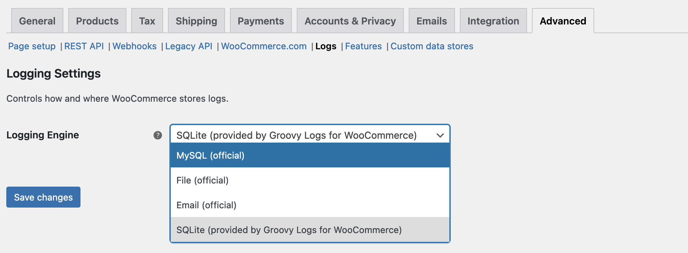

Groovy Logs for WooCommerce
===========================

> 💡 This project is an exploration of custom logging implementations in WooCommerce. **It is not production ready** and is likely to change considerably (in other words, it is unstable).

### Makes it easier to change logging engine

Traditionally, WooCommerce offers a choice between three logging engines: database, file and email. However, changing engine requires an adjustment to the `wp-config.php` file. Specifically, the `WC_LOG_HANDLER` constant must be defined. This plugin adds a setting (found at **WooCommerce ▸ Settings ▸ Advanced ▸ Logs**) that makes this process easier.

Note that this does not work well if `WC_LOG_HANDLER` is already defined. Do not use this plugin if you are using that constant.

### Adds a new logging engine

In addition to the three engines supplied by WooCommerce, this plugin supplies a SQLite-based logging implementation. It is currently incomplete (notably, the log viewer UI is not implemented) and its use is therefore not recommended at this time.
